# AstrBot 知识库

> [!TIP]
> 需要 AstrBot 版本 >= 4.5.0。
>
> 我们在 4.5.0 版本中重新设计了全新的知识库系统，AstrBot 将原生支持知识库功能。下文介绍的是新版知识库的使用方法。如果您使用的是之前的版本，请参考[旧版知识库使用文档](https://docs.astrbot.app/zh/use/knowledge-base-old), 我们建议您升级到最新版以获得更好的体验。

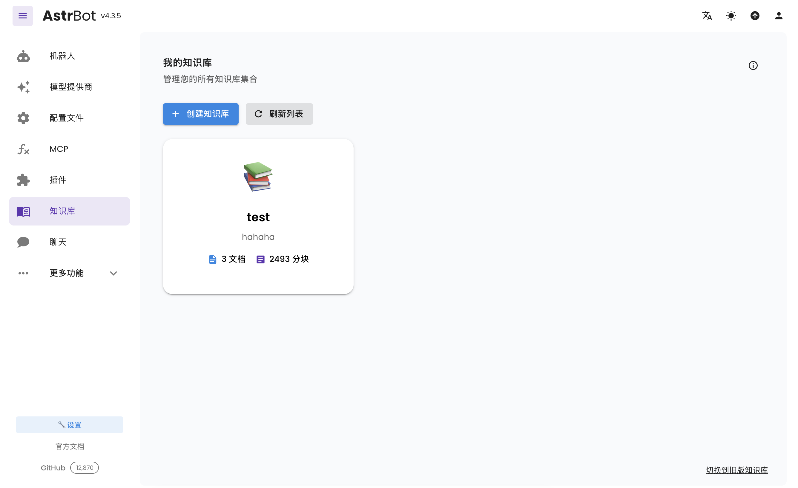

## 配置嵌入模型

打开服务提供商页面，点击新增服务提供商，选择 Embedding，如下图所示：

目前 AstrBot 支持兼容 OpenAI API 和 Gemini API 的嵌入向量服务。

点击上面的提供商卡片进入配置页面，填写配置。

配置完成后，点击保存。

## 配置重排序模型（可选）

重排序模型可以一定程度上提高最终召回结果的精度。

和嵌入模型的配置类似，打开服务提供商页面，点击新增服务提供商，选择重排序。有关重排序模型的更多信息请参考网络。

## 创建知识库

AstrBot 支持多知识库管理。在聊天时，您可以**自由指定知识库**。

进入知识库页面，点击创建知识库，如下图所示：

填写相关信息。在嵌入模型下拉菜单中您将看到刚刚创建好的嵌入模型和重排序模型（重排序模型可选）。

> [!TIP]
> 一旦选择了一个知识库的嵌入模型，请不要再修改该提供商的**模型**或者**向量维度信息**，否则将**严重影响**该知识库的召回率甚至**报错**。

## 上传文件

创建好知识库之后，可以为知识库上传文档。支持同时上传最多 10 个文件，单个文件大小不超过 128 MB。

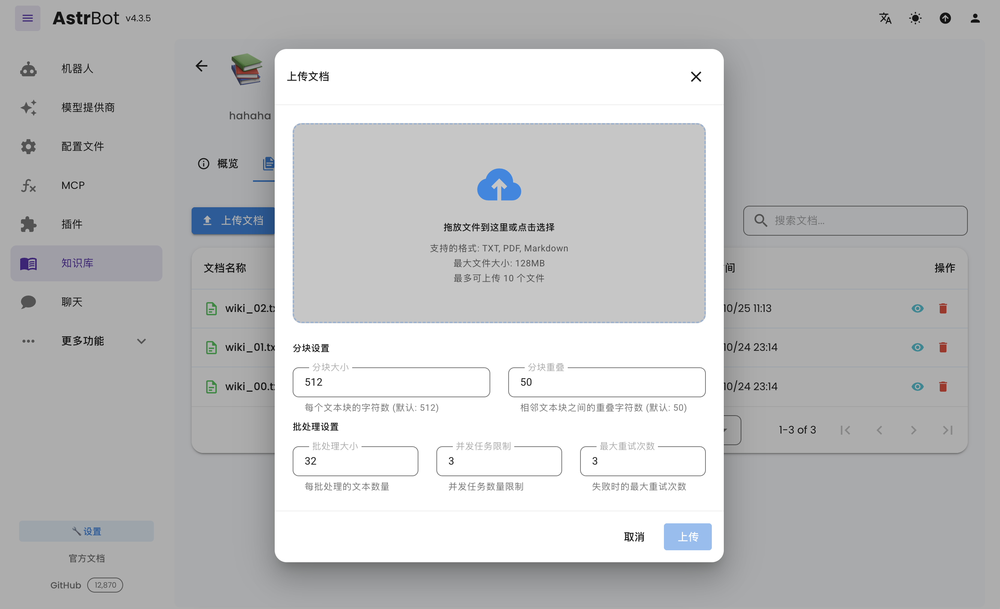

## 使用知识库

在配置文件中，可以为不同的配置文件指定不同的知识库。

## 附录 2：免费的嵌入模型申请

### 硅基流动

截至2025/11/1 硅基流动的`BAAI/bge-m3`还是免费的
[硅基流动官网](https://siliconflow.cn/)
1. 注册账号
2. 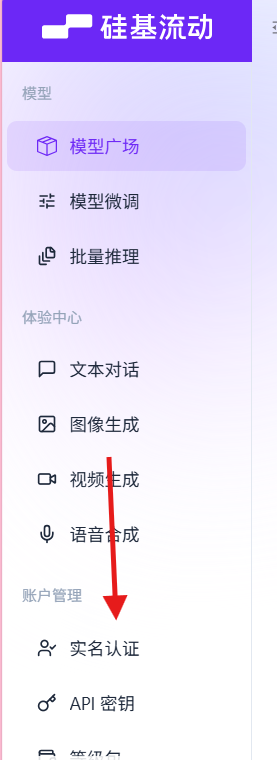过一下实名
3. 打开`Astrbot`,`模型提供商`，选择`新增模型提供商`
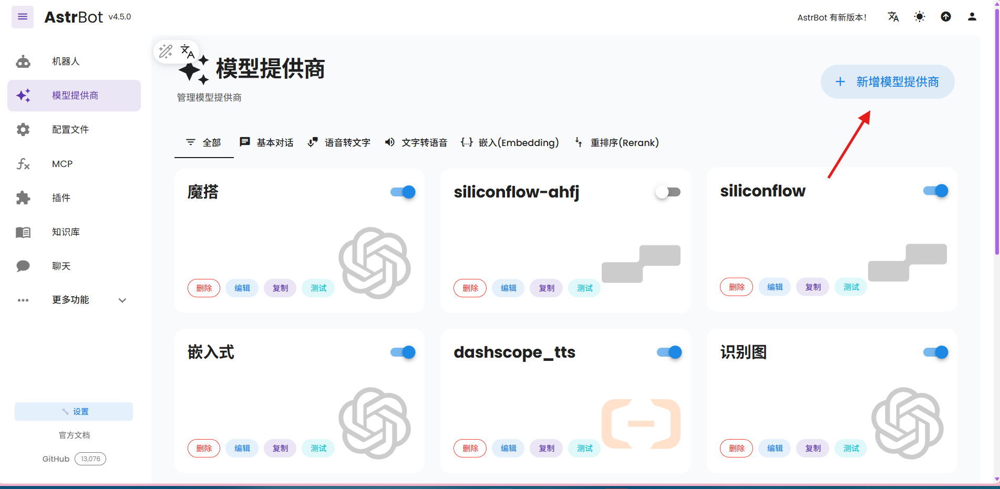
`嵌入(embedding)`,`OpenAI embedding`
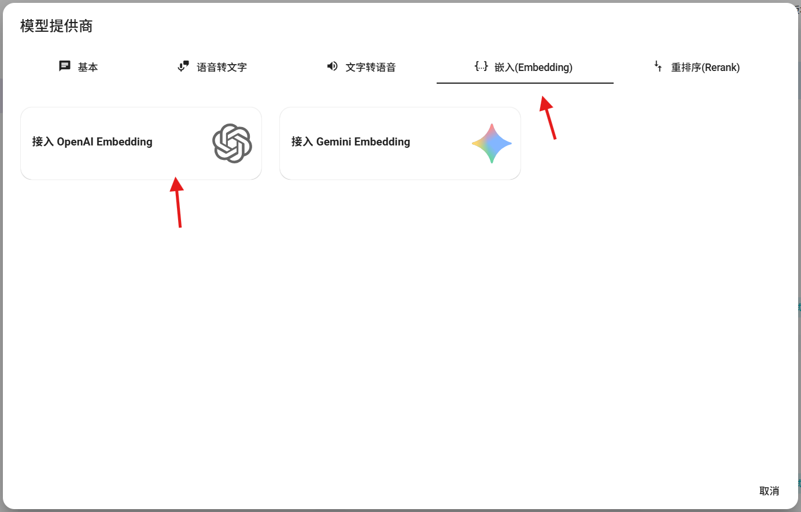
本教程我们主要需要关注

- API Key 
- API Base URL 
- 嵌入模型 
- 嵌入维度
但是我们也需要关注
- ID: 这个可以随便填，用于区分不同的提供商
- 启用:一定要打开
4. 回到硅基流动官网,点击`模型广场`
点击`展开筛选器`,选择`嵌入模型`由于本篇讲的是免费模型，所以我们选择`免费`
选择`BAAI/bge-m3`,点击进入模型详情页
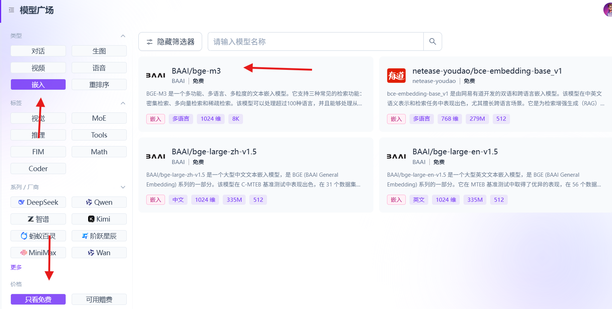
5. 复制`模型ID`，填入到`嵌入模型`中,另一个指向了`xxxx维`把这个数字填入到`嵌入维度`中（这正好是1024就不填了）
> 如果找不到可以使用自动获取试一试

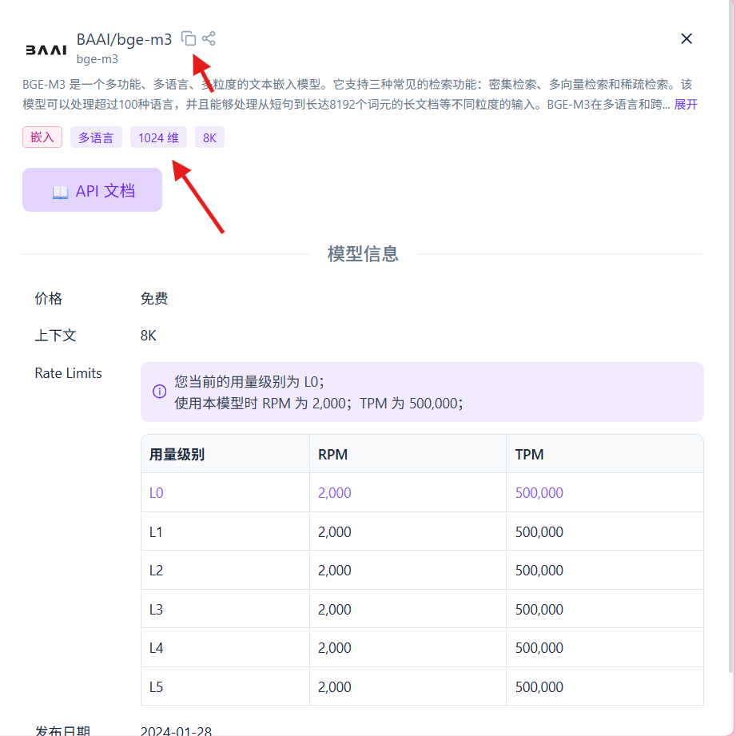
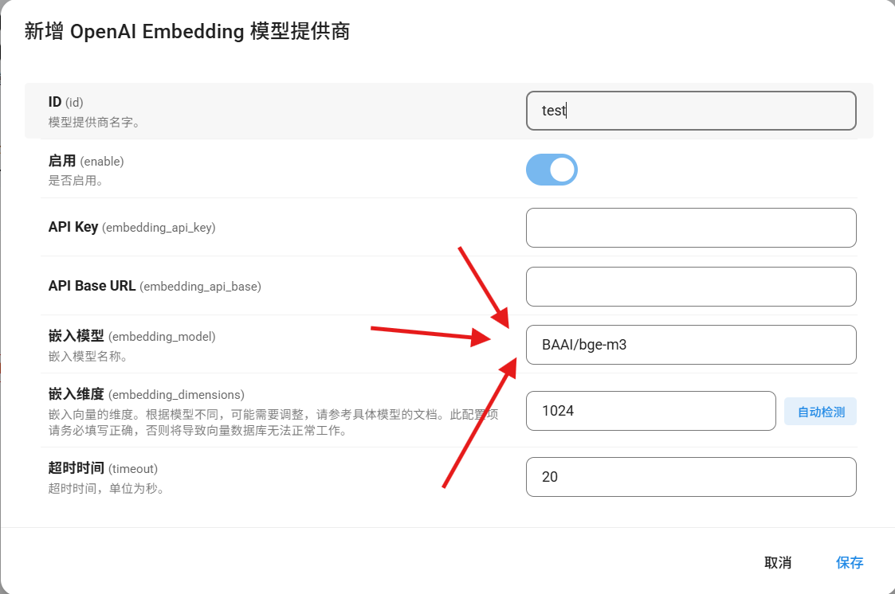 
6. 回到控制台获取`API Key`
点击`API密钥`
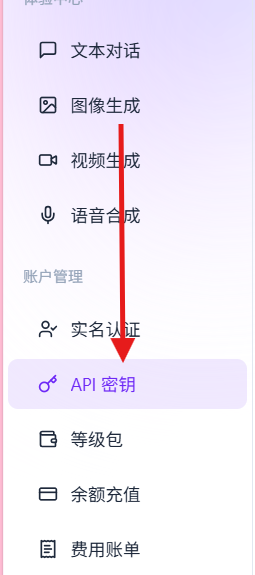
点击`创建API密钥`
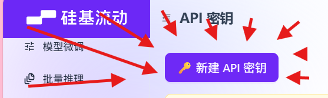
描述信息用于确认密钥，随便填
然后复制密钥到`AstrBot`中
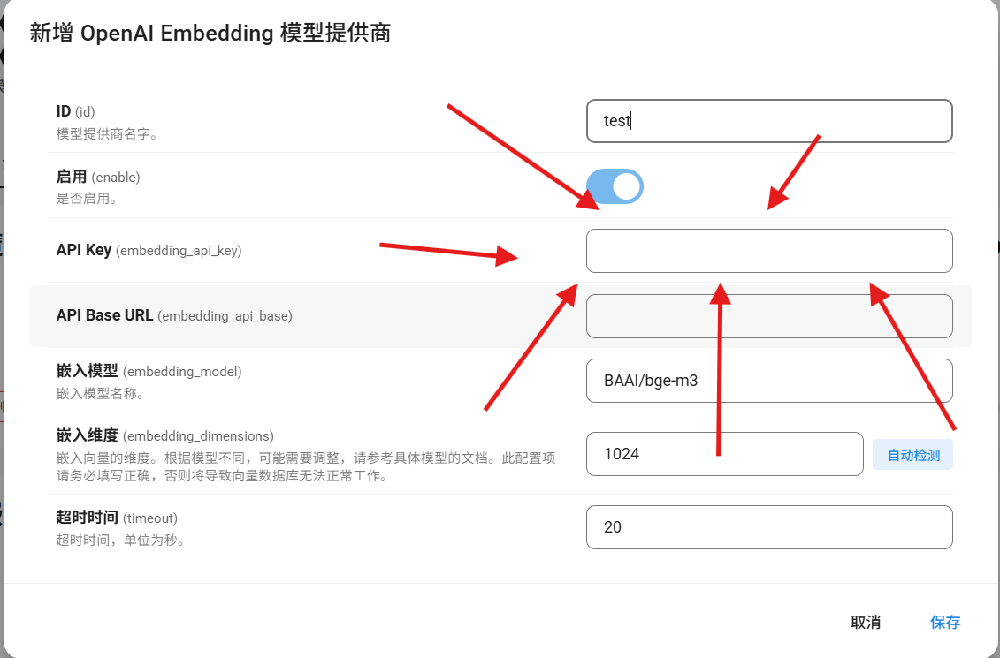
最后获取`API Base URL`，我直接给大家跳关填`https://api.siliconflow.cn/v1`
这样我们就完成了嵌入模型的配置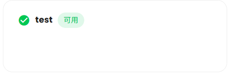